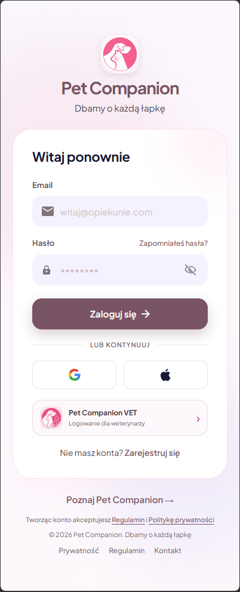
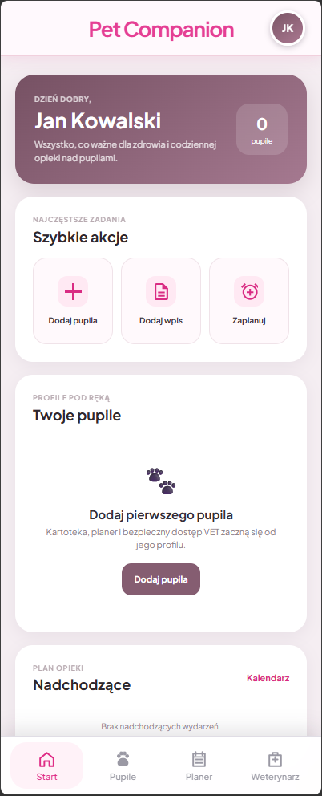
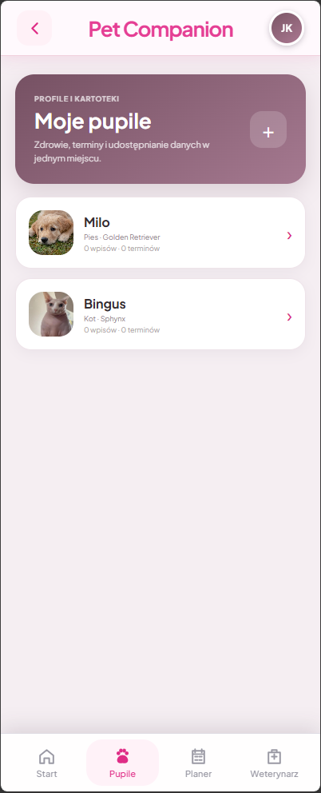
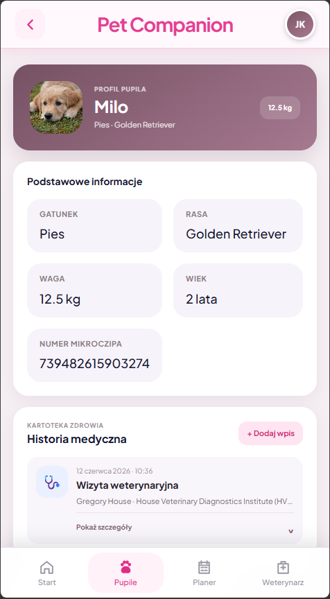
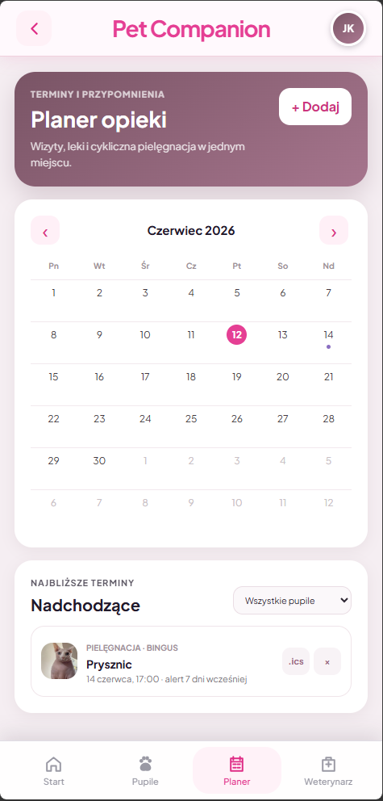
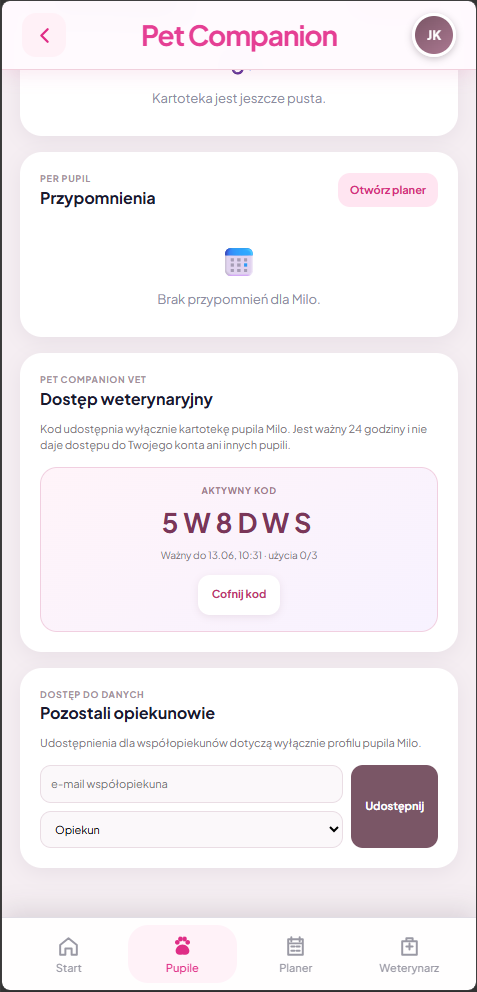
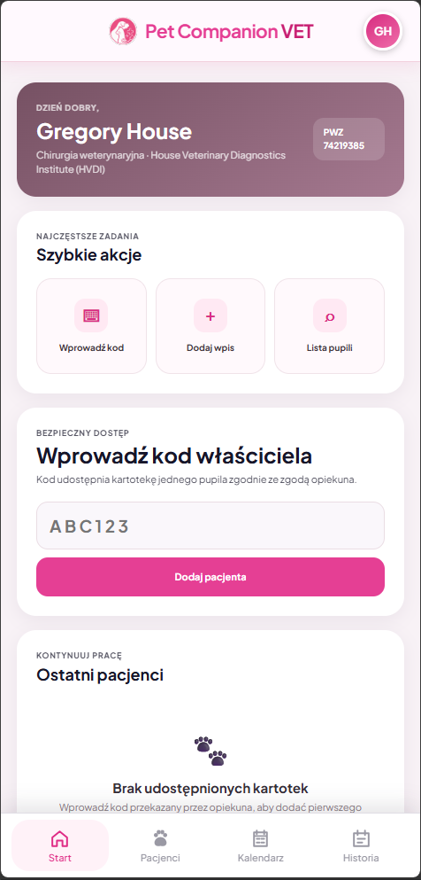
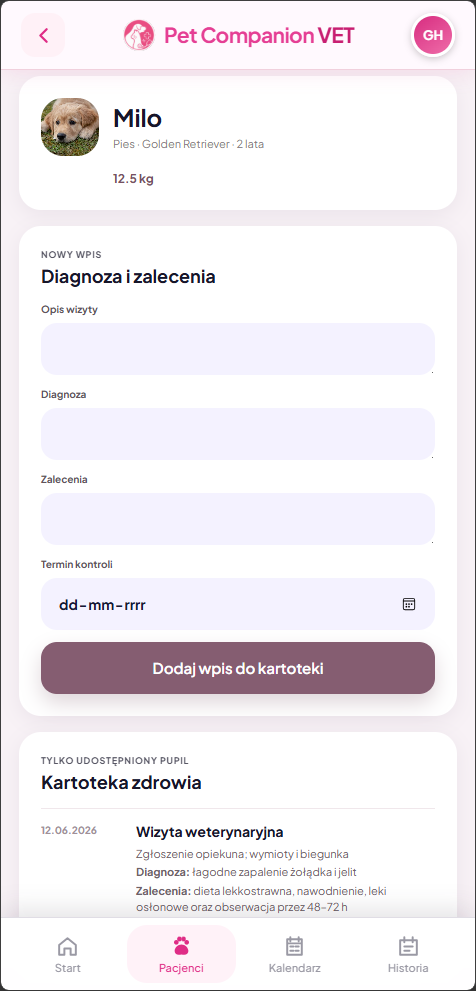

# Pet Companion

<p align="center">
  
</p>

Pet Companion to responsywna aplikacja webowa do prowadzenia profili zwierząt,
historii medycznej i planu opieki. Łączy cyfrową książeczkę zdrowia z osobnym
panelem dla weterynarza, któremu właściciel może bezpiecznie udostępnić kartotekę
wybranego pupila.

Projekt porządkuje informacje, które zwykle są rozproszone pomiędzy papierowymi
dokumentami, wiadomościami, notatkami i kalendarzem. W jednym miejscu można
zapisywać wizyty, szczepienia, leki, wyniki badań, pomiary i kolejne terminy.

## Najważniejsze funkcje

### Panel opiekuna

- rejestracja, logowanie i sesja użytkownika przez Firebase Authentication,
- dashboard z szybkimi akcjami, pupilami, terminami i ostatnią aktywnością,
- obsługa wielu profili zwierząt,
- zapis gatunku, rasy, daty urodzenia, wagi i opcjonalnego 15-cyfrowego numeru
  mikroczipa,
- dodawanie zdjęcia pupila z walidacją, skalowaniem do 720 px i kompresją JPEG,
- osobna kartoteka zdrowia dla każdego pupila,
- wpisy dotyczące wizyt, szczepień, leków, pomiarów, badań i innych zdarzeń,
- dane lekarza i kliniki, diagnoza, dawkowanie, zalecenia i termin kontroli,
- automatyczne tworzenie przypomnienia na podstawie kolejnego terminu we wpisie,
- planer wydarzeń jednorazowych i cyklicznych,
- filtrowanie kalendarza według pupila,
- eksport wydarzeń do plików iCalendar `.ics`,
- udostępnianie profilu współopiekunowi lub weterynarzowi,
- generowanie kodu dostępu ważnego przez 24 godziny,
- określanie limitu użyć oraz cofanie kodów i aktywnych dostępów.

### Panel Pet Companion VET

- osobna rejestracja i logowanie lekarza weterynarii,
- profil zawodowy z numerem PWZ, specjalizacją i danymi kliniki,
- realizacja 6-znakowego kodu przekazanego przez właściciela,
- dostęp tylko do kartoteki pupila wskazanego przez kod,
- lista pacjentów i wyszukiwanie po ich danych,
- podgląd historii medycznej,
- dodawanie wpisów, diagnoz, zaleceń i terminów kontroli,
- kalendarz terminów udostępnionych pacjentów,
- historia uzyskania dostępu, otwierania kartotek i dodawania wpisów.

## Jak działa dostęp VET

1. Opiekun otwiera profil konkretnego pupila.
2. Generuje kod ważny przez 24 godziny i ustala limit jego użyć.
3. Weterynarz realizuje kod w panelu Pet Companion VET.
4. Aplikacja tworzy uprawnienie wyłącznie do wskazanej kartoteki.
5. Opiekun może w dowolnej chwili unieważnić kod lub cofnąć przyznany dostęp.

Weterynarz nie otrzymuje dostępu do konta właściciela ani do pozostałych pupili.

## Technologie

- React 19,
- TypeScript i JavaScript,
- React Router 6,
- Firebase Authentication,
- Create React App i React Scripts,
- CSS,
- Web Vitals,
- Testing Library.

## Architektura

Routing znajduje się w `src/App.js`. Widoki opiekuna korzystają z `AppLayout`,
a panel weterynarza z osobnego `VetAppLayout`.

Stan aplikacji i logika biznesowa są skupione w
`src/context/AuthContext.tsx`. Kontekst przechowuje profile pupili, wpisy,
przypomnienia, udostępnienia, kody dostępu, uprawnienia VET i historię
aktywności.

| Obszar | Główne pliki |
| --- | --- |
| Strona prezentacyjna | `src/pages/Main/` |
| Logowanie i rejestracja | `src/pages/Logowanie/`, `src/pages/LoginPage.jsx` |
| Dashboard opiekuna | `src/pages/Strona_glowna/` |
| Profile i kartoteki pupili | `src/pages/Pupile/` |
| Wpisy medyczne | `src/pages/Wpisy/` |
| Planer | `src/pages/PlannerPage.tsx` |
| Udostępnianie kartoteki | `src/pages/OwnerVetPage.tsx` |
| Panel weterynarza | `src/pages/Vet/` |
| Modele i logika biznesowa | `src/context/AuthContext.tsx` |

### Najważniejsze operacje kontekstu

| Funkcja | Zastosowanie |
| --- | --- |
| `register`, `login`, `logout` | Konto i sesja opiekuna przez Firebase Authentication. |
| `addPet` | Utworzenie profilu pupila. |
| `addEntry` | Dodanie wpisu oraz opcjonalnego przypomnienia. |
| `addReminder`, `removeReminder` | Zarządzanie planerem opieki. |
| `addPetShare`, `removePetShare` | Zarządzanie współdzieleniem profilu. |
| `generateVetAccessCode` | Wygenerowanie czasowego kodu dostępu. |
| `redeemVetAccessCode` | Walidacja kodu i nadanie uprawnienia lekarzowi. |
| `revokeVetAccessCode`, `revokeVetGrant` | Cofnięcie kodu lub dostępu. |
| `canVetAccessPet` | Kontrola dostępu do kartoteki w panelu VET. |
| `logVetActivity` | Rejestrowanie działań weterynarza. |

## Struktura projektu

```text
src/
|-- components/          współdzielone komponenty i układy aplikacji
|-- context/             modele danych, stan i logika biznesowa
|-- pages/
|   |-- Logowanie/       logowanie opiekuna
|   |-- Main/            publiczna strona prezentacyjna
|   |-- Pupile/          lista, dodawanie i profil pupila
|   |-- Strona_glowna/   dashboard opiekuna
|   |-- Vet/             panel weterynarza
|   `-- Wpisy/           formularz wpisu medycznego
|-- firebase.ts          konfiguracja Firebase
`-- App.js               routing aplikacji

docs/
`-- screenshots/         zrzuty ekranów użyte w README
```

## Uruchomienie lokalne

Wymagane są Node.js i npm.

```bash
git clone https://github.com/kpal17/pet-companion.git
cd pet-companion
npm install
npm start
```

Aplikacja będzie dostępna pod adresem
[`http://localhost:3000`](http://localhost:3000).

## Skrypty

| Polecenie | Działanie |
| --- | --- |
| `npm start` | Uruchamia serwer deweloperski. |
| `npm test` | Uruchamia testy w trybie interaktywnym. |
| `npm run build` | Tworzy zoptymalizowany build produkcyjny w `build/`. |

## Galeria

| Logowanie opiekuna | Dashboard opiekuna |
| --- | --- |
|  |  |

| Lista pupili | Profil i kartoteka pupila |
| --- | --- |
|  |  |

| Planer opieki | Udostępnianie kartoteki |
| --- | --- |
|  |  |

| Dashboard Pet Companion VET | Kartoteka pacjenta w panelu VET |
| --- | --- |
|  |  |

## Aktualny stan projektu

Firebase Authentication obsługuje rejestrację, logowanie i sesję opiekuna.
Profile pupili, kartoteki, przypomnienia oraz dane panelu VET są obecnie
przechowywane w stanie React. Pełne odświeżenie aplikacji zeruje te dane.

Kolejnym etapem rozwoju może być zapis danych w Cloud Firestore, trwałe
przechowywanie zdjęć oraz podłączenie rzeczywistych powiadomień.

## Autor
Projekt rozwijany w ramach pracy nad aplikacją Pet Companion.

[Kamil Pałubiak](https://github.com/kpal17)
[Bartosz Mordarski](https://github.com/BartoszMordarski)
[Rafał Palinceusz](https://github.com/RafalPalinceusz)
